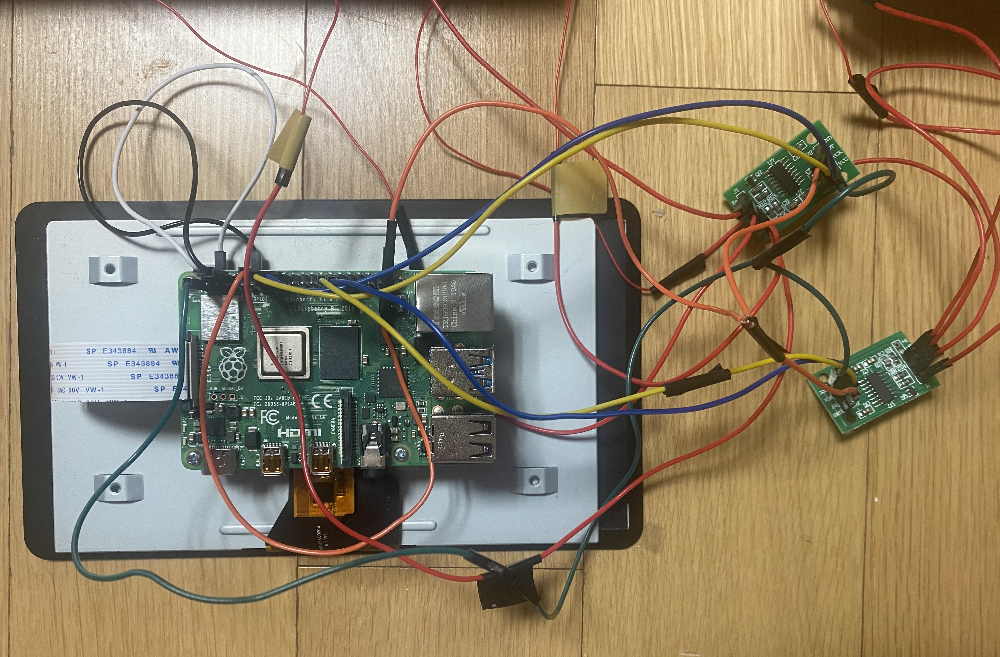
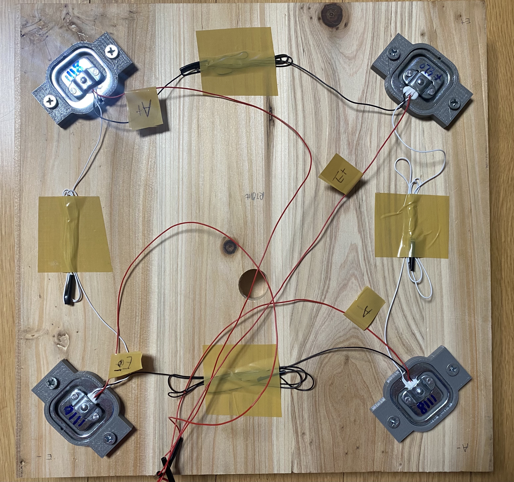
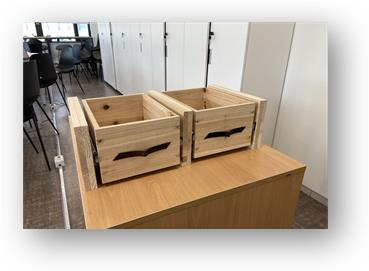
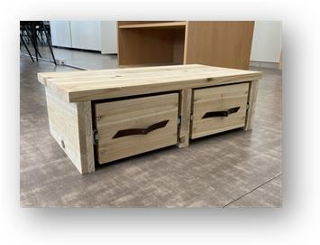
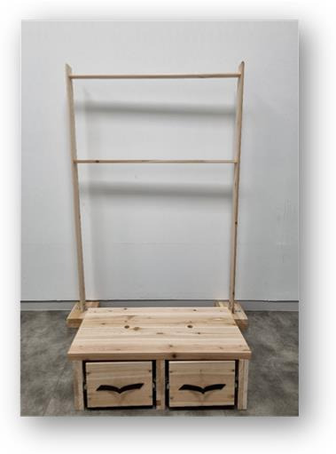
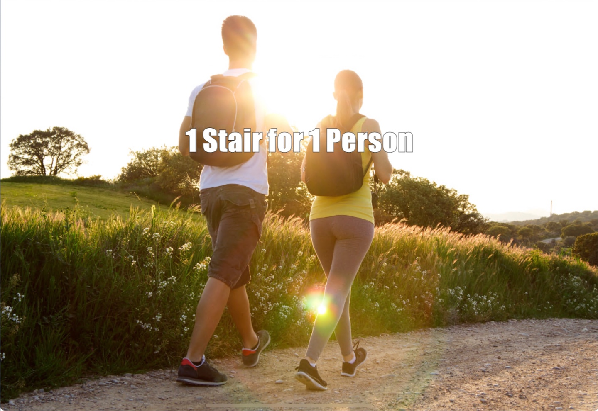
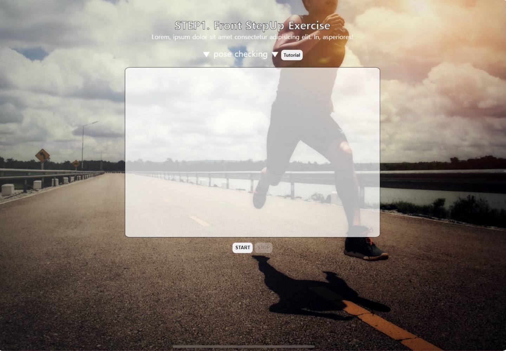
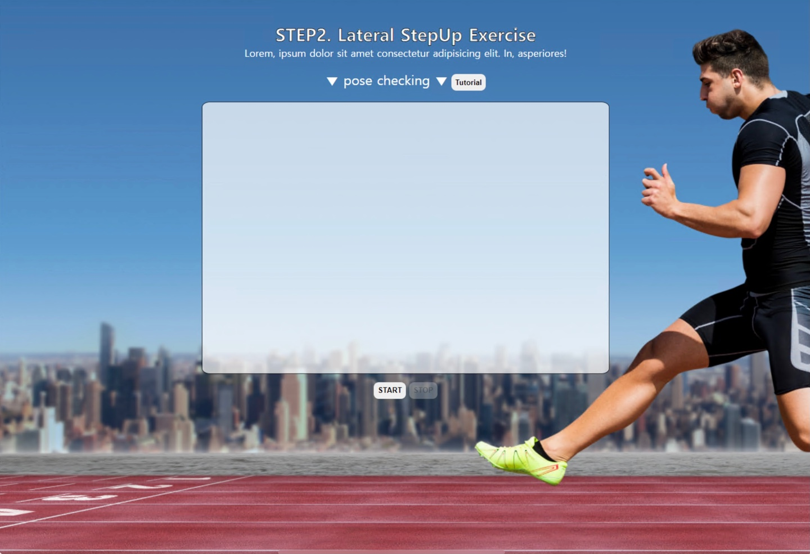
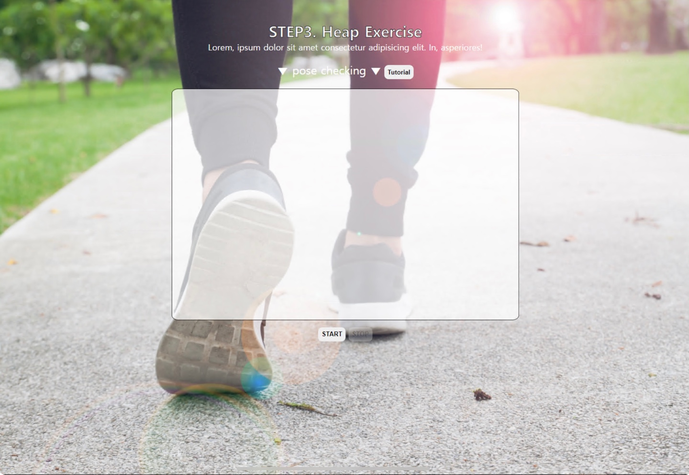
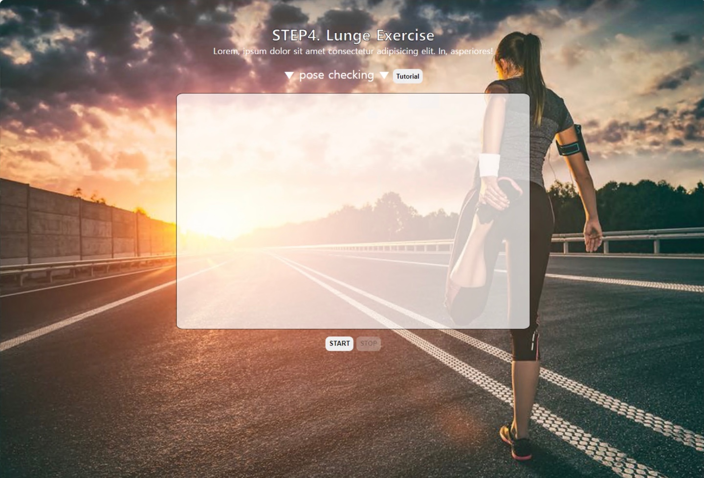

# 1Stairfor1Person
The purpose of this project is 

## 1. Requirments
Code is written in JavaScript and Python3.6 requires:
* Library
  * _Flask 1.1.1+_
  * _pyOpenSSL 1.1.1a+_
  * _HX711 1.1.2.3+_
  * _RPI.GPIO 0.7.0+_
  * _mediapipe 0.8.5+_
* HardWare
  * _Raspbarry PI 3+_
  * _LoadCell_
  * _HX711_
  * _WebCam_

----------

## 2. Installation
**Flask**
```
pip install flask
```
**pyOpenSSL**
```
pip install pyOpenSSL
```
**HX711**
```
pip install HX711
```
**RPI.GPIO**
> It can be installed on Raspberry PI only!
```
pip install RPI.GPIO
```
**OpenPose**
> Please check follow. [LINK1](https://github.com/google/mediapipe) [LINK2](https://google.github.io/mediapipe/solutions/pose.html)
```
pip install mediapipe
```

----------

## 3. HardWare
**Control Part**
```
- Two HX711 are used using parallel connection
 * HX711 for left side: 
    GPIO.setmode(GPIO.BCM)
    uses (dout_pin = 5, pd_sck_pin = 6, gain_channel_A = 64, select_channel = 'A')
    
 * HX711 for right side: 
    GPIO.setmode(GPIO.BCM)
    uses (dout_pin = 23, pd_sck_pin = 24, gain_channel_A = 64, select_channel = 'A')
```
<p align="center">
 
</p>

**Sensing Part**
```
- Each loadcell can measure up to 50kg
- Circuit: Full bridge circuit of loadcell
```
<p align="center">
 
</p>

**Whole Part** <br/>
<p align="center">
 
 
 
</p>

----------

## 4. SoftWare
**Concept Diagram** <br/>
<p align="center">
 
</p>

----------

## 5. Demonstration
**Procedure**
> #### 1. Use openpose for checking whether person is doing several step-excercises: 
> ```
> * Openpose code runs in javascript
> * OpenPose source code is from https://google.github.io/mediapipe/solutions/pose.html
> ```
> #### 2. Use loadcells for checking total count a person stepped up and down the step-box checking difference of weights measured
> ```
> * source code of running load cells runs in raspberry using flask server
> * when a user clicks stop button in webpage, ajax sends request using POST method to flask server 
>   and flask server stops counting and response with total count of how many times user stepped up and down 
>   (one step up-down counted as one)
> ```

**WebPage Configuration** <br/>
<p align="center">
 
 
 
 
 
</p>


